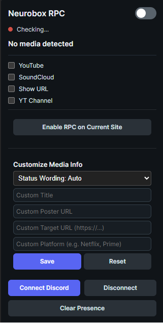
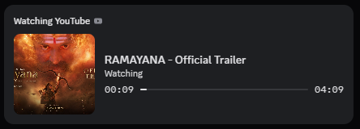
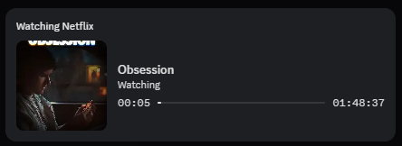
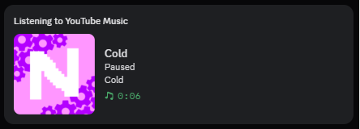

# Neurobox - Discord RPC Extension

A privacy-first Web Extension that automatically displays your media playback in Discord Rich Presence across Chrome, Firefox, Edge, and Brave—without requiring native desktop apps or local servers.

## Screenshots

| Extension Control Panel | Discord Presence of Youtube Video |
|---|---|
|  |  |

| Discord Presence of Universal Web Media | Discord Presence of Youtube Music |
|---|---|
|  |  |

---

## Key Features

### Universal Web Media Detection
* **Any Video or Audio Site**: Enable Discord Rich Presence on any website (e.g., Netflix clones, movie streaming sites, custom video portals) using domain whitelisting in the popup.
* **Embedded Iframe Support**: Tracks video players embedded inside cross-origin `iframe` elements.
* **Automatic Title Cleaning**: Strips site junk, age ratings (`U/A 13+`), runtimes (`2h 12m`), and plot synopses to produce clean movie titles.
* **Poster Extraction**: Automatically extracts high-resolution movie poster images (`og:image` / `twitter:image`).

### YouTube & YouTube Music Enhancements
* **Smart Category Detection**: Distinguishes between **YouTube Videos**, **YouTube Shorts**, and **YouTube Music**.
* **Uploader Avatar Badge**: Displays the uploader's channel avatar as a small badge on the Discord status card.
* **Playback Speed Indicator**: Appends live playback speed indicators (e.g. `1.5x speed`) when watching at non-standard speeds.
* **Instant SPA Navigation**: Instantly updates status when switching between videos, Shorts, or recommendations without page reloads.
* **YT Channel Toggle**: Toggle whether the channel name appears in your status.

### Privacy & Customization Controls
* **Show URL Toggle**: Hide website domain names and link buttons completely for total privacy.
* **Custom Status Wording**: Select between **Auto**, **Watching**, **Listening to**, **Browsing**, **Idling on**, or **None**.
* **Custom Official Platform Name**: Make third-party streaming sites display as official services like `Netflix`, `Prime Video`, `Disney+`, or `IMDb`.
* **Custom Target URL**: Override button links to point to any custom URL.
* **Manual Title & Poster Overrides**: Override movie titles or poster images per website.
* **Discord Rate Limit Cooldown**: Graceful handling of Discord's HTTP 429 rate limit window.

---

## Installation & Setup

### Firefox (Manifest V3)
1. Open Firefox and navigate to `about:debugging#/runtime/this-firefox`.
2. Click **Load Temporary Add-on...**
3. Select `manifest.json` from the Neurobox directory.

### Chrome / Edge / Brave
1. Open your browser and navigate to `chrome://extensions`.
2. Enable **Developer mode** in the top-right corner.
3. Click **Load unpacked** and select the Neurobox project folder.

### Connecting Discord
1. Click the Neurobox extension icon in your toolbar.
2. Click **Connect Discord** to sign in with your Discord account.
3. Once connected, your active video/audio playback will automatically show on your Discord profile!

---

## Privacy Notice (Important)

This extension uses Discord OAuth with the `openid sdk.social_layer_presence` scope to set your Discord Rich Presence via headless sessions.

> **Why does Discord request so many permissions?**
> The Discord OAuth scope `sdk.social_layer_presence` requests permissions that sound broad. This is because Discord's individual activity-writing scopes (`rpc.activities.write` and `activities.write`) are locked to developer-whitelisted apps. The `sdk.social_layer_presence` scope grants access to set user presence without running a local RPC server. Your data is kept strictly local in your browser and is never stored on external tracking servers.

---

## License

Copyright (C) 2026

This program is free software: you can redistribute it and/or modify it under the terms of the **GNU Affero General Public License** as published by the Free Software Foundation, version 3.

See the [LICENSE](LICENSE) file for more details.